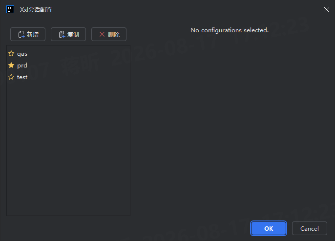
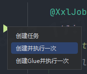
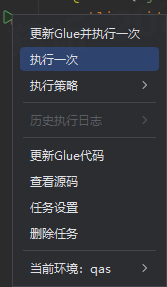
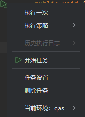

# Xxl Linker

Xxl Linker is dedicated to reducing the hassle of configuring projects on xxl-job and helping developers with tasks like remote debugging.

`Xxl Linker`致力于减少项目在xxl-job上配置的繁琐程度，并协助开发者完成远程调试等工作。

[//]: # ([![JetBrains Plugin Version]&#40;https://img.shields.io/jetbrains/plugin/v/PLUGIN_ID&#41;]&#40;https://plugins.jetbrains.com/plugin/PLUGIN_ID&#41;)

[//]: # ([![JetBrains Plugin Downloads]&#40;https://img.shields.io/jetbrains/plugin/d/PLUGIN_ID&#41;]&#40;https://plugins.jetbrains.com/plugin/PLUGIN_ID&#41;)

---

## 📦 安装 Install

- **通过 JetBrains Marketplace：** **from marketplace:**  
    1. 打开 IDE，进入 `File > Settings > Plugins`。
    2. 切换到 `Marketplace` 标签页，搜索 `Xxl Linker`。
    3. 点击 `Install` 安装并重启 IDE。
  >1. Open IDE and switch into plugin settings.
  >2. Switch to marketplace and search `1Xxl Linker`.
  >3. Click `Install` and restart your IDE.
- **本地手动安装：** **from local**
    1. 从 [Releases](link-to-your-releases-page) 页面下载最新 `.zip` 包。
    2. 在 IDE 插件设置中，点击齿轮图标 ⚙️，选择 `Install Plugin from Disk...`。
    3. 选择下载的 `.zip` 文件并重启 IDE。
  > 1. Download the latest package from [Releases](link-to-your-releases-page)
  > 2. Click `Install Plugin from Disk...` item in the setting list of the IDE plugin Settings with three dots icon.
  > 3. Select the package and restart your IDE.

## 🚀 功能特性 Features

<!-- 用简洁的列表说明核心功能，建议配图 -->
- ✨ **核心功能一**：  
Java Bean任务管理。  
Task manage of Java Bean.
- 🎨 **核心功能二**：  
Java Glue任务管理。  
Task manage of Java Glue.
- ⚡ **核心功能三**：  
Shell任务管理。  
Task manage of Shell.

## 📝 使用说明

1. 在工具栏中点击`xxl会话配置`,并在弹出窗口中配置xxl会话环境。  
`工具`->`xxl会话配置`->`新建配置`  
Config your xxl session with the dialog from `xxl会话配置` in tools bar. 
  
`注：推荐生产环境开启星标，所有高危操作会弹出确认提示框`  
`Open star tag for suggestion, which will require your second confrim for all dangerous operations on pruduct environment.`

2. 配置完成后在项目中选择需要配置/执行的XxlJob任务，点击左侧的运行图标选择需要创建的任务类型。   
Click the `Run` icon on the left of your function with `@XxlJob` annotation and choose the job type you want to create.  
`xxlJob方法行`->`左侧运行标志`->`创建任务类型`

3. 运行图标会根据任务种类的不同进行变换，再次点击运行图标可以在弹出菜单中根据需要触发相应的任务或更新任务配置。   
The Run Icon will change as your job type, and it will pop the task menu after you click the run icon.  
   `xxlJob方法行`->`左侧运行标志`->`触发任务`

## 🔧 开发与构建 Developer

<!-- 为有意贡献代码的开发者提供指引 -->
本项目使用 Gradle 构建，遵循 `IntelliJ Platform Plugin` 模板。

This project build by Gradle, following the `IntelliJ Platform Plugin` template.

### 环境要求 Environment Require

- JDK 8 或更高版本
- IntelliJ IDEA (Community 或 Ultimate)

- JDK over 8
- IntelliJ IDEA (Community or Ultimate)

> tips: xxl测试基准版本v2.3.0  
> the project is based on xxl v2.3.0
